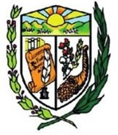

```{r setup, include=FALSE}
knitr::opts_chunk$set(echo = TRUE, fig.cap = TRUE)

setwd('F:/Proj_R/Hidrologico_24_de_mayo') 

library(kableExtra)
library(flextable)
library(officer)
library(officedown)
library(ggplot2)
library(grid)
library(dplyr)
library(tidyr)
library(gridExtra)
library(cowplot)
library(patchwork)
library(imager)
library(imagerExtra)

# Aspect ratio de todas las figuras.
pic1 <- load.image(file = "Imagenes/Escudo.jpg")
ar_pic1 <- dim(pic1)[2]/dim(pic1)[1] #find our aspect ratio

# pic2 <- load.image(file = "Procedim_experim_1.jpg")
# ar_pic2 <- dim(pic2)[2]/dim(pic2)[1] #find our aspect ratio
# 
# pic3 <- load.image(file = "Vista2.jpg")
# ar_pic3 <- dim(pic3)[2]/dim(pic3)[1] #find our aspect ratio
# 
# pic4 <- load.image(file = "Procedim_experim_2.jpg")
# ar_pic4 <- dim(pic4)[2]/dim(pic4)[1] #find our aspect ratio
# 
# pic5 <- load.image(file = "Procedim_experim_3.jpg")
# ar_pic5 <- dim(pic5)[2]/dim(pic5)[1] #find our aspect ratio
# 
# pic6 <- load.image(file = "Personajes_hid.jpg")
# ar_pic6 <- dim(pic6)[2]/dim(pic6)[1] #find our aspect ratio

#estilos para ser aplicados.
# fp <- fp_par(
#   text.align = "center", 
#   padding.bottom = 20, padding.top = 120, 
#   border.bottom = fp_border())
# 
# ft <- fp_text(shading.color='#EFEFEF', bold = TRUE, italic = TRUE, font.family= "Arial")
# 
# ft2<-fp_text(color="black", font.family= "Arial", font.size= 12)
# fp2<-fp_par(text.align='justify')

ft1<-fp_text(bold = TRUE, italic = FALSE, font.size= 14, font.family= "Arial")
ft2<-fp_text(bold = TRUE, italic = FALSE, font.size= 16, font.family= "Arial")
fp1<-fp_par(text.align='center')
```


```{r echo=FALSE, fig1, fig.asp=ar_pic1, fig.width=1.5, fig.align='center', message=FALSE, warning=FALSE}

#fig.asp=ar_pic1, fig.height=1, fig.pos="H"



```


`r ftext("CONTRATO N°.: LCC-GADM24M-2022-003", ft1)` `r fp1`

<br>

`r ftext("FASE-1", ft2)` `r fp1`

<br>

`r ftext("INFORME DE MONOGRAFÍA, HIDROLOGICO E HIDRAULICO", ft2)` `r fp1`

<br>

<br>

`r ftext("AGOSTO 2022", ft2)` `r fp1`

\pagebreak

# Tabla de contenidos.
<br>
<!---BLOCK_TOC--->

\pagebreak

# Lista de figuras.
<br>
<!---BLOCK_TOC{seq_id: 'fig'}--->

# Lista de tablas.
<br>
<!---BLOCK_TOC{seq_id: 'tab'}--->


\newpage

# Introducción.

<br>

Aquí va la introducción

## Objetivo general.

<br>

## Objetivos específicos.

<br>

# Materiales y métodos.

<br>

# Zona de estudio.

<br>


